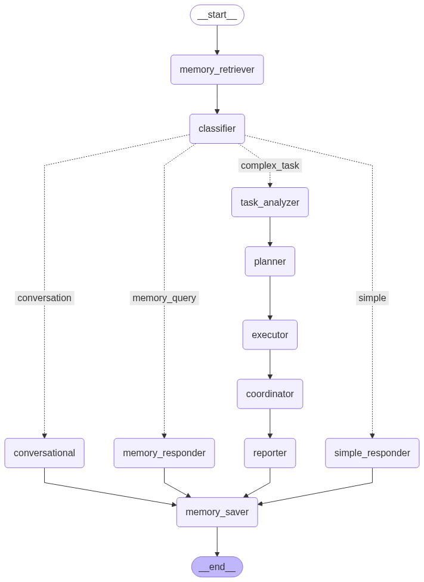

# Agentic_Chatbot

[](https://www.python.org/)
[](https://streamlit.io/)
[](https://python.langchain.com/)
[](https://langchain-ai.github.io/langgraph/)
[](https://groq.com/)
[](https://agentic-chatbot-1-t3r5.onrender.com/)

> An intelligent AI assistant that orchestrates specialized agents for complex task execution while maintaining conversational memory for personalized interactions.

## 🚀 **Live Demo**

**Try the application live:** [https://agentic-chatbot-1-t3r5.onrender.com/](https://agentic-chatbot-1-t3r5.onrender.com/)

*Experience the full power of memory-enhanced agentic assistance in your browser!*

## 🌟 Features

### 🧠 **Memory System**
- **Conversational Memory**: Remembers past interactions and context
- **User Profile Learning**: Builds understanding of user preferences and interests
- **Context-Aware Responses**: Leverages historical data for better assistance
- **Experience-Based Optimization**: Improves task execution based on previous similar projects

### 🤖 **Multi-Agent Orchestration**
- **Dynamic Task Decomposition**: Automatically breaks down complex tasks into manageable subtasks
- **Specialized Agent Roles**: Each task handled by domain-specific virtual agents
- **Dependency Management**: Smart execution order based on task dependencies
- **Parallel Processing**: Efficient task coordination with async execution

### 🎯 **Query Classification**
- **Simple Q&A**: Direct informational queries with memory context
- **Complex Tasks**: Multi-step project planning and execution
- **Memory Queries**: Access to conversation history and past experiences
- **Conversational**: Natural dialogue with personality consistency

## 🏗️ Architecture

The system uses LangGraph to create a sophisticated workflow that processes different types of queries through specialized nodes:



### Core Components

1. **Memory Retriever**: Finds relevant past conversations
2. **Query Classifier**: Determines appropriate handling strategy
3. **Simple Responder**: Handles direct Q&A with context
4. **Memory Responder**: Processes memory-related queries
5. **Task Analyzer**: Breaks down complex tasks
6. **Agent Orchestrator**: Coordinates specialized agents
7. **Memory Saver**: Stores conversations for future reference

## 🚀 Supported Domains

### 📅 Event & Workshop Organization
- Requirements analysis, venue booking, speaker coordination
- Marketing campaigns, registration systems, logistics management

### 💻 Software Development
- Requirements gathering, architecture design, UI/UX planning
- Backend/frontend development, testing, deployment

### 📈 Marketing Campaigns
- Strategy development, market research, content creation
- Channel management, analytics, campaign optimization

### 🎉 Event Planning
- Theme development, guest management, venue coordination
- Catering, entertainment, decorations, photography

### 🏢 Business Strategy
- Market analysis, business planning, resource allocation
- Project management, execution monitoring, quality assurance

## 📋 Prerequisites

- Python 3.8+
- Groq API key (sign up at [groq.com](https://groq.com/))
- Required Python packages (see requirements.txt)

## ⚙️ Installation

1. **Clone the repository**
   ```bash
   git clone https://github.com/AbhishekPandey91/Agentic_Chatbot.git

   cd memory-enhanced-agentic-assistant
   ```

2. **Install dependencies**
   ```bash
   pip install -r requirements.txt
   ```

3. **Set up environment variables**
   Create a `.env` file in the project root:
   ```env
   GROQ_API_KEY=your_groq_api_key_here
   ```

4. **Run the application**
   ```bash
   streamlit run memory.py
   ```

## 🎮 Usage Examples

### Simple Queries
```
"Who is the Prime Minister of India?"
"What is artificial intelligence?"
"How does blockchain work?"
```

### Complex Task Orchestration
```
"Organize a robotics workshop for 50 people"
"Develop a mobile banking application"
"Create a marketing campaign for eco-friendly products"
```

### Memory Interactions
```
"What did we discuss last time?"
"Remember what projects we worked on before?"
"What topics am I most interested in?"
```

## 🔧 Configuration

### Memory Settings
- **Max Memories**: Stores last 50 conversations (configurable)
- **Relevance Scoring**: Combines recency, topic overlap, and text similarity
- **User Profile**: Tracks interests, conversation style, and past tasks

### LLM Configuration
- **Model**: DeepSeek-R1-Distill-Llama-70B via Groq
- **Temperature**: 0.7 for balanced creativity and consistency
- **Async Processing**: Non-blocking task execution

## 📊 Memory System Details

### Data Structures
- **ConversationMemory**: Stores individual interactions with metadata
- **UserProfile**: Maintains user preferences and behavioral patterns
- **TaskNode**: Represents individual tasks in complex workflows

### Context Integration
- Relevant memories retrieved for each query
- User profile influences response style and content
- Past experience optimizes task decomposition

## 🎨 User Interface

### Streamlit Features
- **Interactive Chat**: Real-time conversation with memory context
- **Progress Tracking**: Visual feedback during task execution
- **Memory Dashboard**: View conversation history and profile
- **Export Options**: Download memory data for backup

### Example Buttons
- Quick access to common query types
- Memory exploration commands
- Task orchestration examples

## 🛠️ Development

### Project Structure
```
├── memory.py              # Main application file
├── requirements.txt       # Python dependencies
├── .env                  # Environment variables
├── graph.py              # Graph visualization script
├── graph.png             # Workflow diagram
└── README.md            # This file
```

### Key Classes
- `EnhancedAgentOrchestrator`: Main orchestration engine
- `MemoryManager`: Handles conversation storage and retrieval
- `TaskNode`: Represents individual tasks with dependencies
- `GraphState`: Maintains workflow state throughout execution

## 🔍 Graph Visualization

Generate the workflow diagram:

```python
from memory import EnhancedAgentOrchestrator
x = EnhancedAgentOrchestrator()
app = x._create_graph()
graph_image = app.get_graph().draw_mermaid_png()
with open("graph.png", "wb") as f:
    f.write(graph_image)
```

## 📈 Performance

- **Response Time**: Optimized with async processing
- **Memory Efficiency**: Configurable history limits
- **Scalability**: Modular agent architecture
- **Error Handling**: Graceful fallbacks for API issues

## 🤝 Contributing

1. Fork the repository
2. Create a feature branch (`git checkout -b feature/amazing-feature`)
3. Commit your changes (`git commit -m 'Add amazing feature'`)
4. Push to the branch (`git push origin feature/amazing-feature`)
5. Open a Pull Request

## 📝 License

This project is licensed under the MIT License - see the [LICENSE](LICENSE) file for details.

## 🙏 Acknowledgments

- **LangChain** for the foundation framework
- **LangGraph** for workflow orchestration
- **Groq** for high-performance LLM inference
- **Streamlit** for the interactive web interface
- **DeepSeek** for the powerful language model

## 📧 Contact

- **Author**: Abhishek Pandey
- **GitHub**: [@AbhishekPandey91](https://github.com/AbhishekPandey91)
- **Project Link**: [https://github.com/AbhishekPandey91/Agentic_Chatbot](https://github.com/AbhishekPandey91/Agentic_Chatbot)

---

⭐ **Star this repository if you find it helpful!**

*Built with ❤️ using Python, LangChain, and Streamlit*
*Built with ❤️ using Python, LangChain, and Streamlit*
